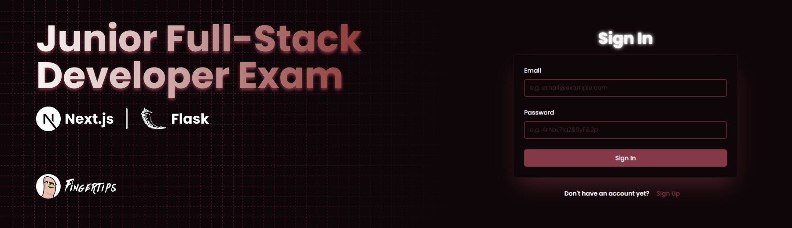

# 🛠️ Junior Full-Stack Exam Project: Next.js & Flask

This project is a full-stack web application developed as part of a junior full-stack developer exam. It features a Next.js frontend, a Flask backend, and implements CRUD operations with JWT-based authentication.

## 📚 <a name="table">Table of Contents</a>

- 🔧 [Technologies Used](#tech-used)
- ✨ [Features](#features)
- 📖 [Setup Instructions](#setup)
- 🐍 [Backend (Flask)](#backend)
- ⚛️ [Frontend (Next.js)](#frontend)
- 🔑 [Environment Variables](#env)
- 🚀 [Running the Application](#run-app)
- 📡 [API Endpoints](#api)
- 🔒 [Authentication](#auth)
- 🤝 [Contributing](#contributing)
- 📜 [License](#license)

## 🔧 <a name="tech-used">Technologies Used</a>

- **Frontend**: Next.js (React) ⚛️
- **Backend**: Flask (Python) 🐍
- **Database**: SQLite 🗄️
- **Authentication**: JWT (JSON Web Tokens) 🔐

## ✨ <a name="features">Features</a>

- **🔒 User Authentication**: Sign-up, login, and JWT-based authentication.
- **📝 CRUD Operations**: Create, Read, Update, and Delete operations for the application’s data models.
- **📱 Responsive UI**: Developed using React components.
- **📡 API**: RESTful API built with Flask.

## 📖 <a name="setup">Setup Instructions</a>

### 🐍 <a name="backend">Backend (Flask)</a>

1. **Clone the repository**:

   ```bash
   git clone https://github.com/Fingertips18/junior-fullstack-exam.git
   cd your-repo/backend
   ```

2. **Create a virtual environment and install dependencies**:

   ```bash
   py -m venv venv
   source venv/bin/activate  # On Windows use `venv\Scripts\activate`
   pip install -r requirements.txt
   ```

3. **Set up environment variables. Create a `.env` file in the backend directory:**:

   ```bash
   SECRET_KEY=your-secret-key

   ADMIN_USERNAME=Administrator
   ADMIN_EMAIL=admin@example.com
   ADMIN_PASSWORD=password123

   TEST_USERNAME=test
   TEST_EMAIL=test@example.com
   TEST_PASSWORD=password123
   ```

4. **Run the backend server**:
   ```bash
   py main.py
   ```

### ⚛️ <a name="frontend">Frontend (Next.js)</a>

1. **Navigate to the frontend directory**:

   ```bash
   cd ../frontend
   ```

2. **Install dependencies**:

   ```bash
   npm install
   ```

3. **Set up environment variables. Create a `.env.local` file in the frontend directory:**:

   ```bash
   BASE_URL=http://localhost:5000  # Adjust the backend URL if necessary
   SECRET_KEY=your-secret-key
   ```

4. **Run the frontend server**:
   ```bash
   npm run dev
   ```

## 🔑 <a name="env">Environment Variables</a>

The following environment variables should be set:

- **Backend** (`.env`):

  - `SECRET_KEY`: Secret key for JWT encryption.

  - `ADMIN_USERNAME`: Use for testing admin username.
  - `ADMIN_EMAIL`: Use for testing admin email.
  - `ADMIN_PASSWORD`: Use for testing admin password.

  - `TEST_USERNAME`: Use for testing test user username.
  - `TEST_EMAIL`: Use for testing test user email.
  - `TEST_PASSWORD`: Use for testing test user password.

- **Frontend** (`.env.local`):

  - `BASE_URL`: URL of the Flask API.

  - `SECRET_KEY`: Ensures that the data within the token has not been tampered with and confirms the authenticity of the token/user.

## 🚀 <a name="run-app">Running the Application</a>

- **Backend**: `py main.py` or `flask run`

- **Frontend**: `npm run dev`

- Visit `http://localhost:3000` for the frontend and `http://localhost:5000` for the backend.

## 📡 <a name="api">API Endpoints</a>

- **Root**:

  - `GET /`: The root of the server

  - If no `token` is found, a `sign in form` will be show

- **Authentication**:

  - `POST /sign-up`: Register a new user.

  - `POST /sign-in`: Authenticate user and receive JWT.

  - `POST /refresh`: Refresh JWT.

- **Item CRUD Operations**:

  - `GET /api/items`: Retrieve all items.

  - `POST /api/items`: Create a new item.

  - `PUT /api/items/:id`: Update an existing item.

  - `DELETE /api/items/:id`: Delete an item.

- **User Operations** (for testing purposes)

  - `GET /api/users`: Retrieve all users

  - `DELETE /api/users/:id`: Delete a user

## 🔒 <a name="auth">Authentication</a>

This project uses JWT for secure authentication. Tokens are stored in cookies with `HttpOnly` and `SameSite` attributes for enhanced security.
Both the `frontend` and `backend` handle the verification and expiration of the token.

## 🤝 <a name="contributing">Contributing</a>

Feel free to fork this repository and contribute by submitting a pull request. All contributions are welcome!

#### 🧑‍💻 Contributors

<a href="https://github.com/Fingertips18/scroll-wheel-date-picker/graphs/contributors">
  
</a>

_Ghian Tan_ @ _Fingertips_ ([Github](https://github.com/Fingertips18))

## <a name="license">📜 License</a>

This project is licensed under the MIT License.
